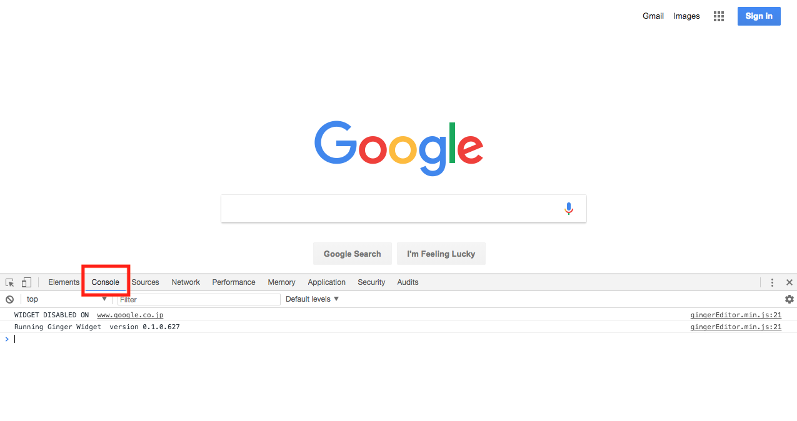
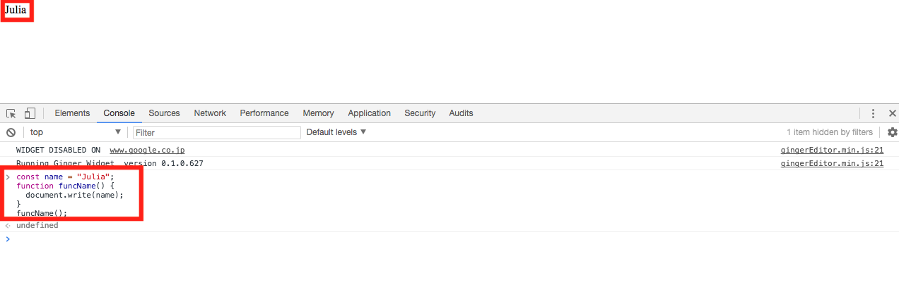
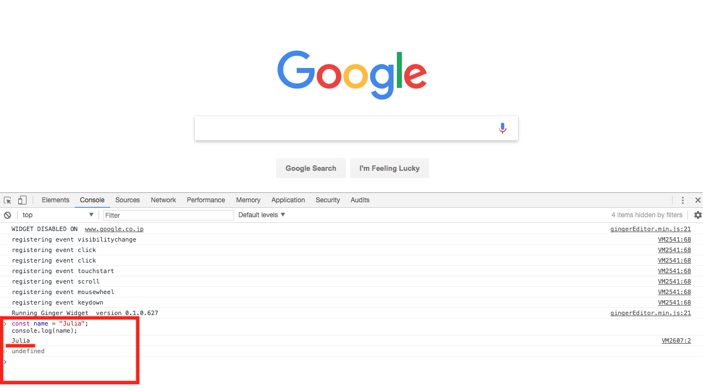
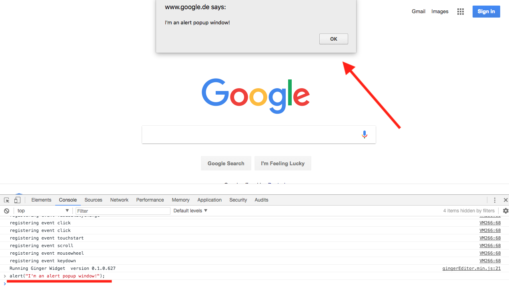
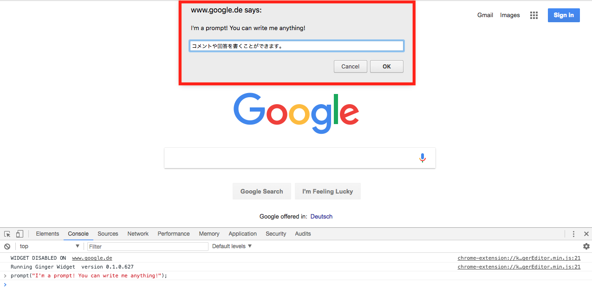
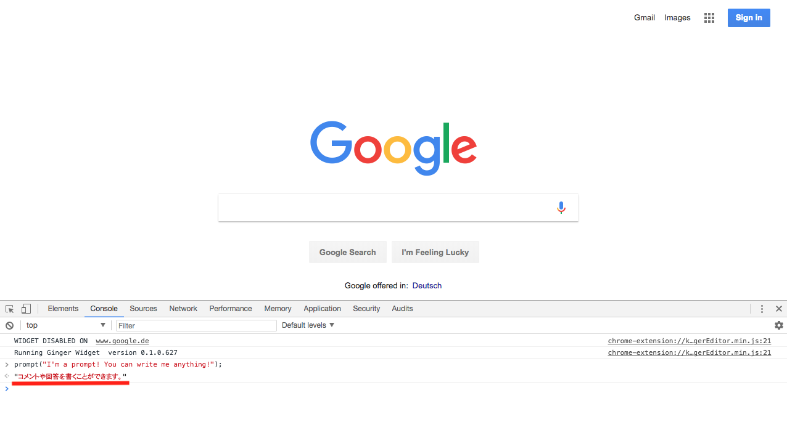
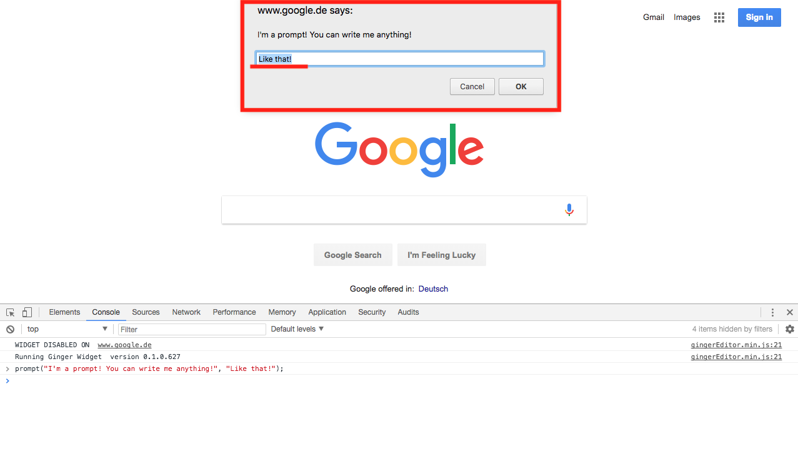
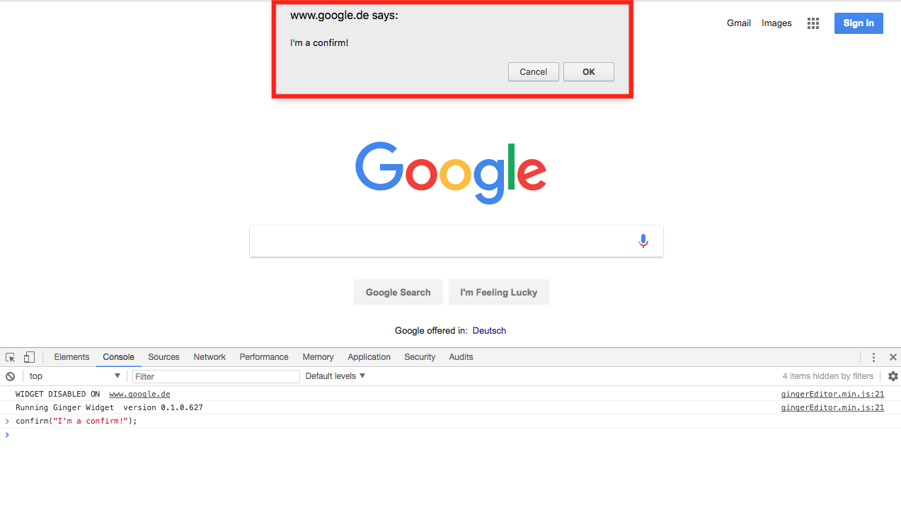

# Lesson 1. はじめてのJavaScript

## 目的

- プログラムの概念を理解する。
- Google Developer Toolsを使ってみる。
- JavaScriptの基本をざっくりと知る。

## プログラムとは

プログラミング言語とは何か簡単に言うと、プログラムを書くための言語を指します。ではプログラムとは何でしょうか？これは、例えると料理のレシピに近いです。例えばカレーを作るためのレシピを想像してください。このレシピは日本語で書かれており、レシピには野菜や肉を切ることから始まって、切った肉や野菜を炒める、煮る、カレー粉を加える、と言った複数の指示が書かれています。これを順番に行っていくと最終的にカレーが出来上がりますよね。

プログラムというのは料理のレシピと同じで、コンピュータに対して、最終的にカレーのような成果物を作るための複数の指示の集合と言えます。例えばレシピでも日本語で書かれていても、英語で書かれていても最終的な成果物は同じかもしれません。同じようにプログラムも同じ成果のものを色々なプログラミング言語で書けます。しかし英語にはない日本語の表現だってあります。例えば英語ではわかめも昆布ももずくも全部"Sea weed"といいます。だから日本食を作るなら日本語が一番向いているといえるでしょう。同じようにプログラミングでも作りたいものによって向いている言語や向いていない言語があります。

実際には、もっと複雑なのですが、まずはプログラムは料理のレシピみたいなもので、プログラミング言語はレシピを書くための言語と認識して頂いて大丈夫です。

## JavaScriptとは？

JavaScriptは、インターネット黎明期の1995年、ネットスケープ(Firefoxの前身)ブラウザにプログラムを加えるために生まれました。その後他のブラウザにも採用されていき、現在ではブラウザ内だけではなく、サーバーやデータベースなど様々な用途で利用されています。

## JavaScriptの歴史

JavaScriptは現在でも進化をし続けています。元々JavaScriptはFirefoxの前身であるネットスケープといういブラウザのために開発されました。その後様々なブラウザに採用される中で標準的な言語仕様が固まりました。この標準的なものを*ECMAScript*と呼びます。現在のブラウザがサポートしているのは、このECMAScriptの5つ目のバージョン(ES5)です。

## ES6(ES2015)

上記の通り、現在のブラウザはES5までをサポートしていますが、2015年には次世代のES6(2015年に固まったのでES2015とも呼ばれる)の仕様が固まりました。 ES6ではES5にあった様々な欠点が改善されており、今後主要ブラウザでもサポートされていきます。またES6のコードをES5のコードへと変換する(トランスパイルと呼ぶ)ツールが多くあり、既に多くの企業がES6を当たり前のように使っています。このことから、CodeGritでもこのES6を基準にレッスンを行っていきます。今後レッスンの中でJavaScriptと書く時はES6のことを指します。

## JavaScriptとJavaは違う言語

よくJavaScriptのことをJavaと訳す方がいて、JavaScriptとJavaを一緒だと考える方がいますがこの2つは全く別の言語です。なぜ名前が似ているのかというと当時から広く使われていたJavaの人気に便乗しようというマーケティング目的だそうです。そのため、JavaScriptを略したい場合は"Java"ではなく"JS"と呼びます。

## フロントエンド開発におけるJavaScript

フロントエンドでの開発はHTML、CSS、JavaScriptの3つが互いを補う形で出来ています。HTMLはコンテンツの構造や内容を表現し、CSSはそのコンテンツのスタイルを定義するもの、そして最後にJavaScriptは表示されているコンテンツに動きを与えます。例えば、以下のような用途でJavascriptが使われています。

- Webサイト上のボタンをクリックしたときに別のコンテンツを表示させる。
- フォーム上でパスワードの長さの確認や、空白がないか確認する。
- Webサーバーにフォームのデータを送信する。

## 式(Expression)と文(Statement)

Javascriptのコードは式と文の組み合わせで出来ています。式とは最終的に何らかの値を返すコードの固まりのことをいいます。例えば、3 + 4 は7という値を返す式です。ここで「+」のことを演算子と呼びますが、

文とは簡単にいうと、何らかの処理を行うためのJavascriptコードの固まりを指します。

これだけでは分かりづらいかと思いますので、以下で詳しくみていきましょう。

## 式(Expression)

式は、分解すると**識別子**（変数名や関数名)と**リテラル値**（1, 'こんにちは'などの数値や文字列）、**演算子**(+,-など)の3つに分けることができます。

数値や文字列、変数名や関数名についてはレッスン2以降で詳しく解説しますが、少し理解しておくと後で理解しやすくなりますので、簡単に解説します。

```js
// nameという変数に"Julia"という値を代入しています。nameが変数名にあたります。
const name = 'Julia';

// 自分の名前を返すsayMyNameという関数。sayMyNameが関数名
function funcName() {
  document.write(name);
}
funcName(); // -> Julia
```

### 変数名

**_変数名_**とは、上記の例で言う「Julia」という文字を入れておく入れ物のことです。
数学の代入の考え方を思い出してみてください。

`name = "Julia"`を`x = 2`などの代入と同じ構成として見ることができますね。
今は `const` や Julia という文字を囲んでいる「''（シングルクォート）」に関して詳しく言及しませんが、レッスン2以降で学んでいきます。

### 関数名

**関数名**とは、上記の例でいうと、`funcName`がそれにあたります。
変数名と非常に似ていますが、関数名は単に入れ物の中身を指定するだけにとどまりません。
呼び出したい機能（関数）を収納することができ、呼び出すと、収納しておいた機能が使えると、ここでは覚えておいてください。

上記の例にある`function`や`document.write`など、その他の部分についても、今後のレッスンで学びます。

### 式の例

以下の例は全て式です。

```javascript
var x = 4; // xという変数に4を代入

x // 4という数値を返す
x + 1 // 5という数値を返す。
1 + 3 // 4という数値を返す
funcName() // 'Julia'という文字列を返す。
```

## 文(Statement)

文には例えば**if文**、**while文**のようなものがあります。先程のsayMyNameという関数も文です。例えば以下はif文を使った例です。

```js
const isTrue = true;

// isTrueという式がif文の中に出てくる
if (isTrue) {
  // 省略
}
```

`isTrue` は上記でも取り上げたように、変数名です。つまり、式と言うことになります。このように式は文の中に一部になることが出来ます。反対に、Javascriptでは文は式になることができません。

例えば、以下の文はJavascriptではエラーを返します。

```javascript
const isHuman = true
const myName = if (isHuman) { return "Julia" }
```

なぜかというと、式は値を返さないので変数myNameに値として格納出来ないためです。

### 文の例

以下の例は全て文です。

```javascript
if(式) { 処理 };
while(式) { 処理 };
for(式) { 処理 };
function(式) { 処理 };
```

## Google Developer Toolsを使ってみよう

ここまで例をいくつか見てきましたが、実際に自分で入力して結果を確認すればより理解が深まると思います。JavaScriptを書いたり、反応を見るための便利なツールの一つに、Google ChromeのDeveloper Toolがあります。

使用の仕方は非常に簡単で、HTML、CSSで学んだ時のように、ブラウザでページを開いた状態から、画面のどこでも良いので右クリックして、**inspect(検証)**を選択します。（もしくはMacであれば、**command + option + I**）

HTML、CSSで見た要素を確認する画面が出てきますが、今回はJavaScriptの検証を行いたいので、以下のスクリーンショットのように**Console**をクリックします。



スクリーンショットのように、HTMLやCSSではない画面にdeveloper tool部分が切り替わりましたね。これでJavaScriptを書いてどう反映されるか検証することができるようになりました。

実際に何か書いてみようと思います。先ほどの式と文で使用した例をいくつか書いて、さらに理解を深めるためにも反応を見てみましょう。

```js
// 式の項目で見た例
const name = "Julia";

function funcName() {
  document.write(name);
}

funcName();
```



画面左上に「Julia」と表示されているのがアウトプットとして視覚的に確認できますね。
値が返ってきて、変数に代入できるので、式と言うことが視覚的にも検証できました。

赤枠で囲んであるdeveloper tool部分にカーソルを置くと書くことができ、**Enter**キーで検証結果が反映されます。
この検証もHTMLやCSSの時と同様、一時的に検証するためのものなので、ページをリロードすると元に戻ります。

もう一つ何か書いてみましょう。

```js
// 式の例
const name = 'Julia';
```


式は値を返すので、ページに値である「Julia」が表示されるかと思いきや、何もページには指定した値が表示されていません。
さらに、赤枠で囲んであるdeveloper toolのコンソール部分を確認しても、「Julia」ではなく`undefined`がアウトプットで返ってきています。

実は、これは単に式=nameがアウトプットするよう呼ばれていないため、返答として予想した値の「Julia」が返されていないだけなのです。
`undefined`もClass 2で取り扱いますが、値の一つです。
値が設定されていない場合には`undefined`が値として返されます。

### console.log

では指定した値である「Julia」を返すにはどうしたら良いのでしょうか？
JavaScriptでは頻繁に使う方法で、以下の書き方を使って、`name`に入っている値を表示させます。

```js
const name = 'Julia';
console.log(name);
```

この`console.log();`の結果を見てみましょう。



今度はコンソール上に「Julia」が値として返ってきました。
`console.log();`は、非常に便利なツールで、JavaScriptのデバッグ（エラーを見つけること）には必ず使用します。
`console.log();`は主に変数に入っている値を確認する際に活用します。
上記の例では、`name（変数）`に入っている値をコンソールに表示させて確認することができたと言うことになります。

長いJavaScriptや複雑なコードや構成になると、このデバッグ機能がとても役立ちます。

このような要領で、Google ChromeのDeveloper ToolsをJavaScriptでは検証の際に使用していきます。

## 演算子(Operator)

演算子と一言で言っても、異なる種類の演算子がいくつか存在します。
まずは一番簡単で、数学でも取り扱われるものも含む**算術演算子/四則演算**を見ていきましょう。
その他の演算子は、レッスン3で詳しく学びます。

### 算術演算子/四則演算

レッスン2にも少し関係のある内容ですが、JavaScriptでは計算もできます。
ただし、数学と少し異なる部分もあり、文字（文字列と言います。詳細はレッスン2で学びます。）や文章同士を連結させるのにも使用します。

文字や文章同士の連結は1つの例ですが、詳細はレッスン2でも学びますので、今の所は算術演算子は、算術で使用するものと同じか、似た用途で使うものと覚えておいてください。

一覧にした方がわかりやすいので、算術演算子の一覧をまずは見ていきましょう。

| 算術演算子 | 説明 | 実例 | 結果 |
| ------------- | ------------- | ------------- | -----:|
| + | 加算 | 3 + 1 | 4 |
| - | 減算 | 3 - 1 | 2 |
| / | 除算 | 3/2 | 1.5 |
| * | 乗算 | 3*4 | 12 |
| % | 除算の剰算 | 3%2 | 1 |
| - | 単項符号反転 | -y | yの負の値 |
| + | 単項プラス | +y | yが文字列である場合に数値に変えることができる |
| ++ | 前置インクリメント | ++y | yに1を足す。式の値は1を加えたあとの値になる |
| ++ | 後置インクリメント | y++ | yに1を足す。式の値は1を加える前の値になる |
| -- | 前置デクリメント | --y | yから1を引く。式の値は1をマイナスしたあとの値になる |
| -- | 後置デクリメント | y-- | yから1を引く。式の値は1をマイナスする前の値になる |

以下は、各演算子を利用した計算の例です。

```js
let y = 4;
let x = 3 - -y; // 7

x++ // 7
x // 7
x = x % 3 // 1
x = x * 3 // 3
```

上記の`var x = 3 - -y;`を詳しく見ていきましょう。これは**単項符号反転**を使用した計算ですが、減算の`-`よりも**単項符号反転**が優先されて評価されます。そのため、アウトプット（答え）として`7`が返ってきます。

**単項符号反転**はJavaScriptでよく使用する演算子ですので、**単項符号反転が減算よりも優先されて評価を受ける**ということを覚えておきましょう。
（単項プラスも同じことが言えますが、あまり使用頻度は高くありません。）

## 大文字小文字の区別

先ほど上記にも出てきた変数名ですが、変数名をつけるときに、大抵は変数自体に関連のあるわかりやすい変数名をつけることが良いとされています。

上記の例のように、人の名前を変数に入れたい場合は名前に関連のある、`name`のような変数名にするのが一般的です。

HTMLのクラス属性やid属性でも該当箇所に関連のある属性の名前にしますね。

ただし、JavaScriptでは大文字と小文字の書き方に留意すべき点があるので、以下に比較例を紹介します。

```js
fuzzylittleturtle // ×

FuzzyLittleTurtle // ×

fuzzy_little_turtle // 正解 非推奨

fuzzyLittleTurtle // 正解 推奨
```

1番上の例はまず単語の区切りが分かりづらく読みにくいですね。そのためJavaScriptではこの書き方はしません。

2番目の例は、一番先頭の`Fuzzy`の頭文字が大文字になっていますが、この書き方はJavaScriptでは基本的に行いません。（例外もありますが、ここでは触れません。）

3番目の例はアンダースコア「 _ 」が単語ごとに区切りで入れてあるので、どんな変数なのかわかりやすいですね。この書き方は、プログラミングでは**_スネークケース_**と呼ばれています。RubyやPythonのような言語ではこの書き方が標準なのですが、Javascriptでは非推奨となっています。

JavaScriptでもっとも推奨されているのは最後の例です。、一番先頭の**fuzzy**の頭文字を除いて、２つ目以降の単語は頭文字が大文字になっています。この書き方を、**_キャメルケース_**と呼びます。ラクダのコブのように大文字箇所を識別しているためです。

今後、CodeGritではJavaScriptの標準に従いこのキャメルケースを利用します。

## コメント

JavaScriptのコメントは、基本的には以下のように書くことができます。

```js
// これはjsのコメント
```

ただし複数行にわたるコメントは以下のように書きます。

```js
/*
これもJavaScriptのコメント。
ただし複数行の場合に書くコメント。
CSSのコメントに似ていますね。
*/
```

## 予約語（KeywordsとReserved Words）

JavaScriptには、あらかじめ用意されている**予約語**と言うものが存在します。
これは例えば変数を宣言するときに使われる`var`などがそれに当たります。
JavaScriptですでに用意されているキーワードの`var`を、関数として以下のように使用したとしましょう。

```js
var var = function() {
  console.log('not working!');
}

var(); // エラーとして"Uncaught SyntaxError: Unexpected token var"が返る
```

予約語`var`が関数のfunctionとして使用されていなければ、このコードの結果はdeveloper toolに "not working!" と文字列として表示されたはずです。

しかし、すでにJavaScriptで用意されている予約語である`var`を関数として使用したことによってエラーメッセージが返ってきました。
予約語は変数名でももちろん使用することができず、エラーになります。

※ ここでは詳細はまだ触れませんが、予約語は変数、関数の他にもメソッド、オブジェクトの識別子でも使用できません。

以下は予約語の一覧です。

```
break case catch class const continue debugger
default delete do else enum export extends false
finally for function if implements import in
instanceof interface let new null package private
protected public return static super switch this
throw true try typeof var void while with yield
```

## alert、promptとconfirm

JavaScriptには、ポップアップウィンドウを表示させる機能があらかじめ用意されています。用意されているポップアップウィンドウも、1種類だけでなく、3つここでは紹介します。

### alert

`alert`は以下のように書くことで、ブラウザの環境であればポップアップウィンドウを表示させることができます。

```js
alert('I\'m an alert popup window!');
```



`alert` のポップアップウィンドウの特徴として、ポップアップウィンドウに表示されるコンテンツは以下の2つです。

| alert |  |
| ------------- | -----:|
| "I'm an alert popup window!" という質問文 | "OK"ボタン |

ユーザーに対して、「同意」や「確認」と言った意味合いの確認のみボタンとして表示されるのが特徴です。

### prompt

`prompt`も以下のように書くことで、似たポップアップウインドウを表示させることができます。

```js
prompt('I\'m a prompt! You can write me anything!');
```



`alert`のポップアップウインドウとは違って、今度はテキストを記入できる欄が表示されました。「コメントや回答を書くことができます。」と記入してみましょう。

`alert`の時とは違って、OKボタンの外にCancelボタンも表示されています。「コメントや回答を書くことができます。」とテキストを記入した後に、OKボタンを押すとどうなるか変化を見てみましょう。



先ほど記入したテキストが文字列として返ってきたのが分かります。Cancelボタンを押した場合は`null`として値が返されます。

`prompt`は、こんな書き方もできます。

```js
prompt('I\'m a prompt! You can write me anything!', 'Like that!');
```



あらかじめテキスト記入欄に、既に設定した文字列が記入されているのが分かります。
`prompt`のポップアップウィンドウの特徴として、ポップアップウィンドウに表示されるコンテンツは以下の4つです。

| prompt |  |  |  |
| ------------- | ------------- | ------------- | -----:|
| "I'm a prompt! You can write me anything!" という質問文 | "OK"ボタン | "Cancel"ボタン | テキスト記入欄 |

### confirm

`confirm`も`alert`や`prompt`とほぼ同じで、以下のようにポップアップウインドウを表示させることができます。

```js
confirm('I\'m a confirm!');
```



`confirm`の英訳通り、OKかCancelボタンで「確認」を求める内容が表示されました。

`confirm`はボタンを押すことで、Boolean（論理値：詳しくはレッスン2で学びます）、つまり`true`か`false`を値として返します。

`confirm`のポップアップウィンドウの特徴として、ポップアップウィンドウに表示されるコンテンツは以下の3つです。

| confirm |  |  |
| ------------- | ------------- | -----:|
| "I'm a confirm!" という質問文 | "OK"ボタン | "Cancel"ボタン |

`alert`、`prompt`、`confirm`は、最近のWebプログラミングにおいてはあまり使われていませんが、簡単な動作の確認機能をする場合には便利です。

## インデント

JavaScriptを書くときにも、HTMLやCSS同様にコードを綺麗に整えて見やすくするために、**インデント**を揃える必要があります。

別の言い方で表すと「スペースのあけ方」です。

JavaScriptのインデントの揃え方には大きく分けて3種類あります。

| インデントの揃え方 |  |  |
| ------------- | ------------- | -----:|
| tabキー | 半角スペース2個 | 半角スペース4個 |

実は、インデントをなくして、長く一列に書いてもJavaScriptは問題なくコンピューターに認識されます。インデントは、JavaScriptの構造を見やすくするためのオプションだからです。

複雑なコードになると、外枠構造の中にある内側構造（ネスト）がさらに複数あって、解読や理解をするだけで時間がかかってしまいます。他人の書いたコードになればなおさらです。
チームで開発をしている場合でも、1人で開発をしている場合でも、効率よくコードを書くことが難しくなってしまします。

構造を可視化しやすくするために、オプションであってもインデントは重要なのです。
CodeGritでは主に半角スペース2個で揃えていきます。(エディタでTabを押すと自動的に半角スペース4個が入るように設定出来ます。)

## チャレンジ

- [チャレンジ1](./challenge/README.md)

## 更に学ぼう

### 動画で学ぶ

- [JavaScript入門 - ドットインストール](https://dotinstall.com/lessons/basic_javascript_v2)

### 記事で学ぶ

- [Javascriptチュートリアル 入門編 - MDN](https://developer.mozilla.org/ja/docs/Web/JavaScript/Guide/Introduction)
- [Eloquent JavaScript 3rd Edition](http://eloquentjavascript.net/)
