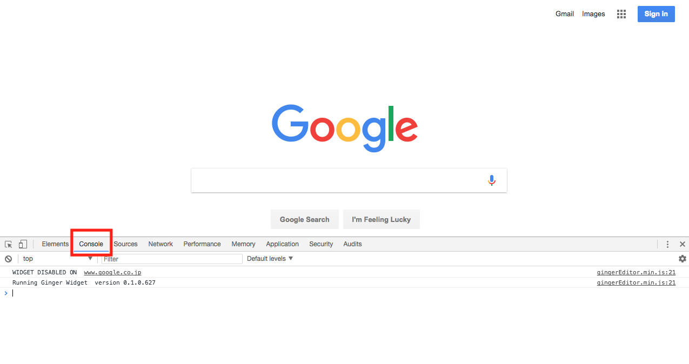
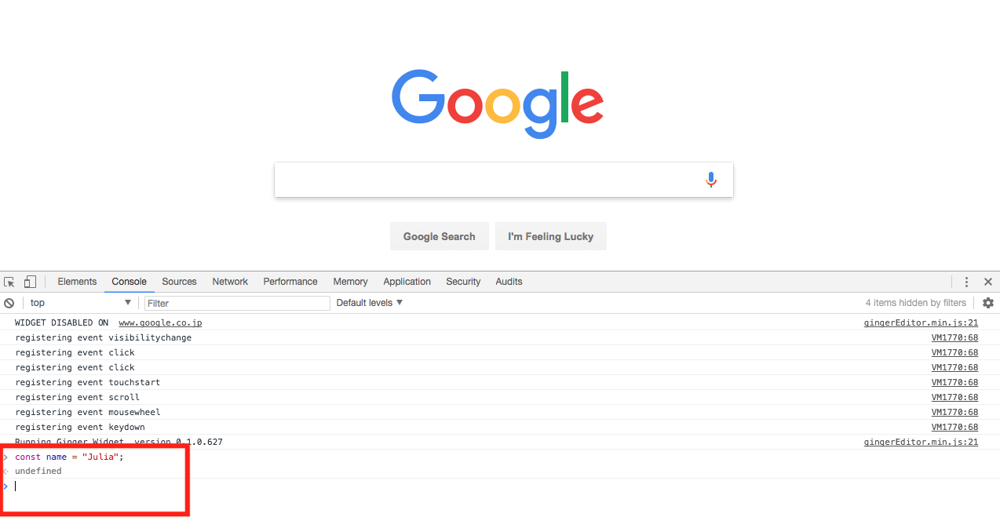

## Google Developer Toolsを使ってみよう

ここまで例をいくつか見てきましたが、実際に自分で入力して結果を確認すればより理解が深まると思います。JavaScriptを書いたり、反応を見るための便利なツールの一つに、Google ChromeのDeveloper Toolがあります。

使用の仕方は非常に簡単で、HTML、CSSで学んだ時のように、ブラウザでページを開いた状態から、画面のどこでも良いので右クリックして、**inspect(検証)**を選択します。（もしくはMacであれば、**command + option + I**）

HTML、CSSで見た要素を確認する画面が出てきますが、今回はJavaScriptの検証を行いたいので、以下のスクリーンショットのように**Console**をクリックします。



スクリーンショットのように、HTMLやCSSではない画面にdeveloper tool部分が切り替わりましたね。これでJavaScriptを書いてどう反映されるか検証することができるようになりました。

実際に何か書いてみようと思います。先ほどの式と文で使用した例をいくつか書いて、さらに理解を深めるためにも反応を見てみましょう。

```js
// 式の項目で見た例
const name = 'Julia';

function sayMyName() {
  document.write(name);
}

sayMyName();
```


画面左上に「Julia」と表示されているのがアウトプットとして視覚的に確認できますね。
値が返ってきて、変数に代入できるので、式と言うことが視覚的にも検証できました。

赤枠で囲んであるdeveloper tool部分にカーソルを置くと書くことができ、**Enter**キーで検証結果が反映されます。
この検証もHTMLやCSSの時と同様、一時的に検証するためのものなので、ページをリロードすると元に戻ります。

もう一つ何か書いてみましょう。

```js
// 式の例
const name = 'Julia';
```



式は値を返すので、ページに値である「Julia」が表示されるかと思いきや、何もページには指定した値が表示されていません。
さらに、赤枠で囲んであるdeveloper toolのコンソール部分を確認しても、「Julia」ではなく`undefined`がアウトプットで返ってきています。

実は、これは単に式=nameがアウトプットするよう呼ばれていないため、返答として予想した値の「Julia」が返されていないだけなのです。
`undefined`もClass 2で取り扱いますが、値の一つです。
値が設定されていない場合には`undefined`が値として返されます。

### console.log

では指定した値である「Julia」を返すにはどうしたら良いのでしょうか？
JavaScriptでは頻繁に使う方法で、以下の書き方を使って、`name`に入っている値を表示させます。

```js
const name = 'Julia';
console.log(name);
```

この`console.log();`の結果を見てみましょう。


今度はコンソール上に「Julia」が値として返ってきました。
`console.log();`は、非常に便利なツールで、JavaScriptのデバッグ（エラーを見つけること）には必ず使用します。
`console.log();`は主に変数に入っている値を確認する際に活用します。
上記の例では、`name（変数）`に入っている値をコンソールに表示させて確認することができたと言うことになります。

長いJavaScriptや複雑なコードや構成になると、このデバッグ機能がとても役立ちます。

このような要領で、Google ChromeのDeveloper ToolsをJavaScriptでは検証の際に使用していきます。