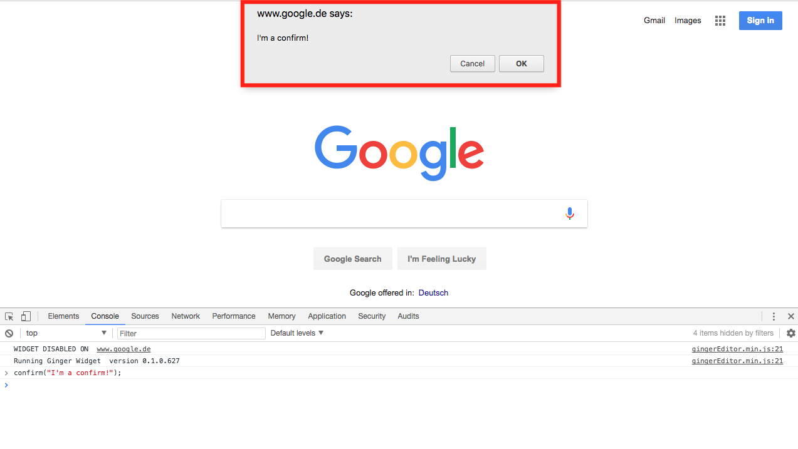

## alert、promptとconfirm

JavaScriptには、ポップアップウィンドウを表示させる機能があらかじめ用意されています。用意されているポップアップウィンドウも、1種類だけでなく、3つここでは紹介します。

尚、モダンなアプリケーションでは、見た目のコントロールが出来ないポップアップウィンドウはあまり利用されません。しかし、知識としては全てのJSプログラマーは知っておくべきです。

### alert

`alert`は以下のように書くことで、ブラウザの環境であればポップアップウィンドウを表示させることができます。

```js
alert('I\'m an alert popup window!');
```

<iframe width="100%" height="300" src="//jsfiddle.net/codegrit_hiro/pfye9oL0/1/embedded/js,result/dark/" allowfullscreen="allowfullscreen" allowpaymentrequest frameborder="0"></iframe>


`alert` のポップアップウィンドウの特徴として、ポップアップウィンドウに表示されるコンテンツは以下の2つです。

| alert |  |
| ------------- | -----:|
| "I'm an alert popup window!" という質問文 | "OK"ボタン |

ユーザーに対して、「同意」や「確認」と言った意味合いの確認のみボタンとして表示されるのが特徴です。

### prompt

`prompt`も以下のように書くことで、似たポップアップウインドウを表示させることができます。

```js
prompt('I\'m a prompt! You can write me anything!');
```

<iframe width="100%" height="300" src="//jsfiddle.net/codegrit_hiro/jxuoL7z0/1/embedded/js,result/dark/" allowfullscreen="allowfullscreen" allowpaymentrequest frameborder="0"></iframe>


`alert`のポップアップウインドウとは違って、今度はテキストを記入できる欄が表示されました。「コメントや回答を書くことができます。」と記入してみましょう。

`alert`の時とは違って、OKボタンの外にCancelボタンも表示されています。「コメントや回答を書くことができます。」とテキストを記入した後に、OKボタンを押すとどうなるか変化を見てみましょう。


先ほど記入したテキストが文字列として返ってきたのが分かります。Cancelボタンを押した場合は`null`として値が返されます。

`prompt`は、こんな書き方もできます。

```js
prompt('I\'m a prompt! You can write me anything!', 'Like that!');
```

<iframe width="100%" height="300" src="//jsfiddle.net/codegrit_hiro/e5p1x473/1/embedded/js,result/dark/" allowfullscreen="allowfullscreen" allowpaymentrequest frameborder="0"></iframe>


あらかじめテキスト記入欄に、既に設定した文字列が記入されているのが分かります。
`prompt`のポップアップウィンドウの特徴として、ポップアップウィンドウに表示されるコンテンツは以下の4つです。

| prompt |  |  |  |
| ------------- | ------------- | ------------- | -----:|
| "I'm a prompt! You can write me anything!" という質問文 | "OK"ボタン | "Cancel"ボタン | テキスト記入欄 |

### confirm

`confirm`も`alert`や`prompt`とほぼ同じで、以下のようにポップアップウインドウを表示させることができます。

```js
confirm('I\'m a confirm!');
```

<iframe width="100%" height="300" src="//jsfiddle.net/codegrit_hiro/e5p1x473/2/embedded/js,result/dark/" allowfullscreen="allowfullscreen" allowpaymentrequest frameborder="0"></iframe>



`confirm`の英訳通り、OKかCancelボタンで「確認」を求める内容が表示されました。

`confirm`はボタンを押すことで、Boolean（論理値：詳しくはレッスン2で学びます）、つまり`true`か`false`を値として返します。

`confirm`のポップアップウィンドウの特徴として、ポップアップウィンドウに表示されるコンテンツは以下の3つです。

| confirm |  |  |
| ------------- | ------------- | -----:|
| "I'm a confirm!" という質問文 | "OK"ボタン | "Cancel"ボタン |

`alert`、`prompt`、`confirm`は、最近のWebプログラミングにおいてはあまり使われていませんが、簡単な動作の確認機能をする場合には便利です。

## インデント

JavaScriptを書くときにも、HTMLやCSS同様にコードを綺麗に整えて見やすくするために、**インデント**を揃える必要があります。

別の言い方で表すと「スペースのあけ方」です。

JavaScriptのインデントの揃え方には大きく分けて3種類あります。

| インデントの揃え方 |  |  |
| ------------- | ------------- | -----:|
| tabキー | 半角スペース2個 | 半角スペース4個 |

実は、インデントをなくして、長く一列に書いてもJavaScriptは問題なくコンピューターに認識されます。インデントは、JavaScriptの構造を見やすくするためのオプションだからです。

複雑なコードになると、外枠構造の中にある内側構造（ネスト）がさらに複数あって、解読や理解をするだけで時間がかかってしまいます。他人の書いたコードになればなおさらです。
チームで開発をしている場合でも、1人で開発をしている場合でも、効率よくコードを書くことが難しくなってしまします。

構造を可視化しやすくするために、オプションであってもインデントは重要なのです。
CodeGritでは主に半角スペース2個で揃えていきます。(エディタでTabを押すと自動的に半角スペース4個が入るように設定出来ます。)

## 更に学ぼう

### 動画で学ぶ

- [JavaScript入門 - ドットインストール](https://dotinstall.com/lessons/basic_javascript_v2)

### 記事で学ぶ

- [Javascriptチュートリアル 入門編 - MDN](https://developer.mozilla.org/ja/docs/Web/JavaScript/Guide/Introduction)

### 本で学ぶ

- [Eloquent JavaScript 3rd Edition](http://eloquentjavascript.net/)

英語ですが完全に無料で公開されています。